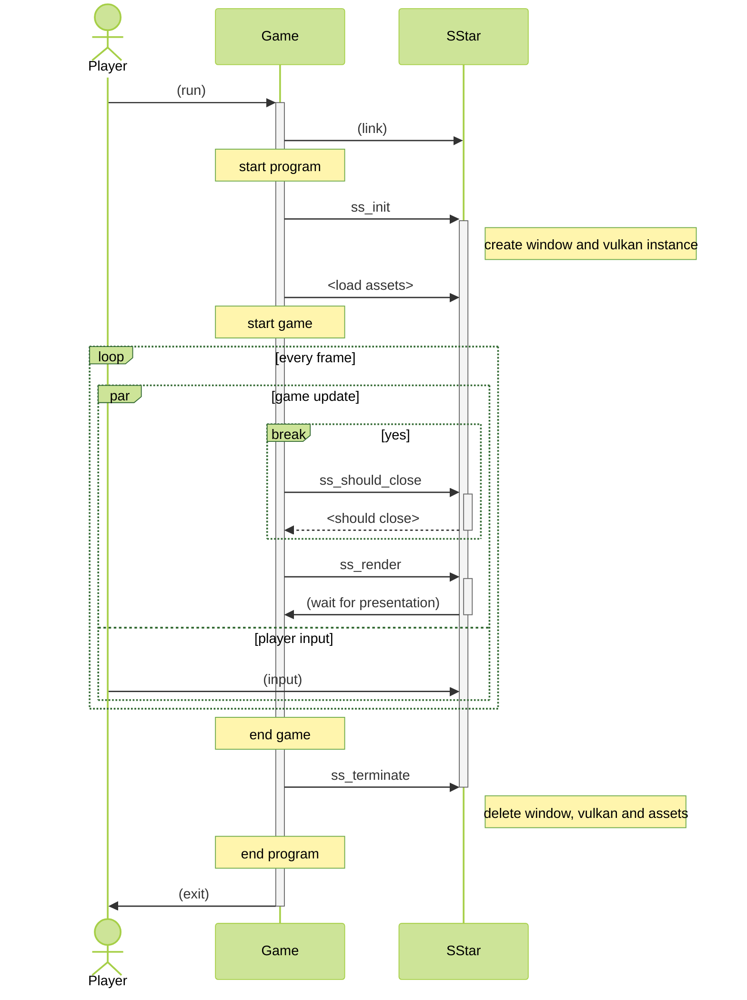

# Usage

## Build a game with Shooting Star

Shooting Star is a SO/DLL, therefore dynamic linking is required to use its functions. For example, if you use gcc as a linker, you can build it as shown below:

```sh
# Linux
gcc ./game.o -L. -lsstar -Wl,-rpath='$ORIGIN'
# Windows
gcc ./game.o ./sstar.dll
```

Of course, if the sstar.so/dll does not exist in the default linking path, this library must be located in the same directory as the game.

## Sequence Diagram


